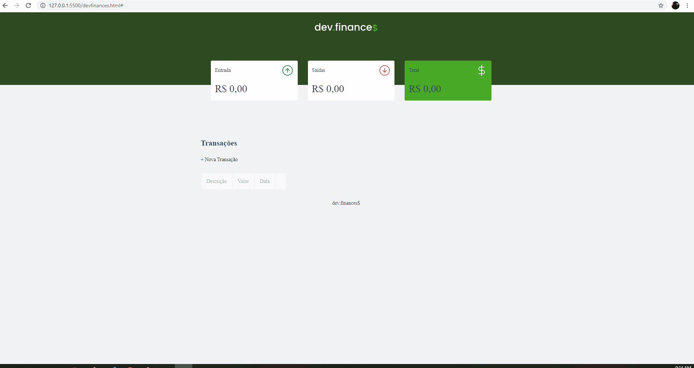

<h1 style="text-align: center;" >DevFinances</h1>

<h2>🚀 Tecnologias</h2>
<ul>
    <li>HTML</li>
    <li>CSS</li>
    <li>JavaScript</li>
</ul>

<h2>💻 Projeto</h2>

Dev.Finances é uma aplicação de controle financeiro onde é possível cadastrar e excluir transferências de entrada e saída!

Este projeto foi desenvolvido durante <strong><a href="https://github.com/rocketseat-education/maratona-discover-01">Maratona Discover 1</a></strong> juntamente com o intrutor <a href="https://github.com/maykbrito">Maiki Brito</a>
!

